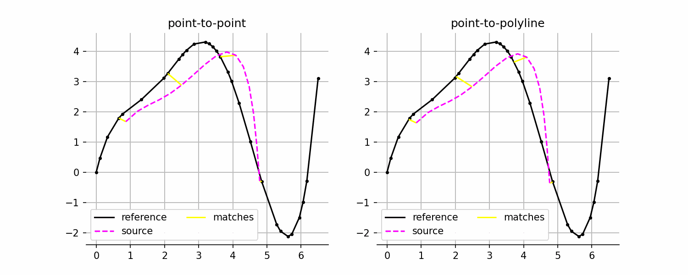
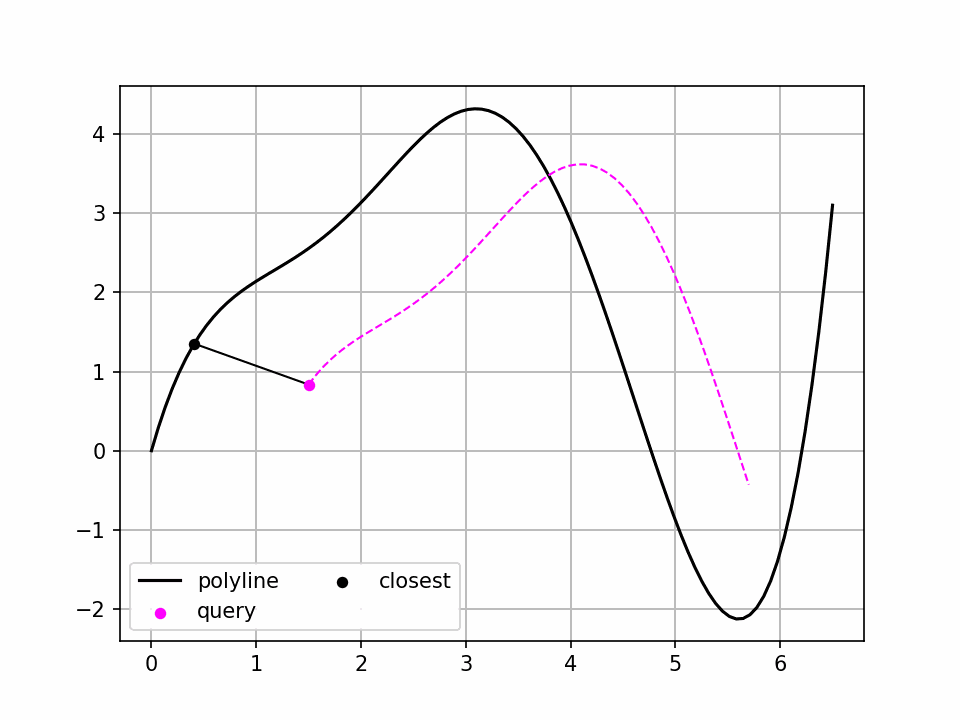

# polyline-icp
A vectorized n-dimensional Iterative Closest Point (ICP) for line-like data.

When matching line-like data (e.g. trajectories or signals), point-to-point matching is feasible only if the underlying signals are densly sampled at the same timesteps. If this is assumption is not met, one can istead match the samples of one signal to the closest interpolated point on the second signal. This is illustrated below



## Features
 - A ridig/similarity motion ICP implementation with weighted pairing functions for point-to-point and point-to-(closed)-line. 
 - A polyline class in n-dimensions that supports vectorized [linear referencing](https://en.wikipedia.org/wiki/Linear_referencing).
 - A weighted rigid/similarity motion estimation from correspondences in n-dimensions.

## Usage

```python
import numpy as np

from polyicp.icp import icp

# Setup a random problem
x = np.random.randn(10, 2)
y = x + np.random.randn(1,2)*1e-2
pidx = np.random.permutation(np.arange(10))

# Perform ICP
r = icp(x[pidx], y, with_scale=False, pairing_fn="polyline")
print(r.x_hat) # final points
print(r.history) # transform history as (s,R,t) tuples
print(r...) # more fields available
```

## Polyline projections

This library comes with a polyline utility to compute the closest points on `L` polylines in `D` dimensions to a set of `M` query points in `D` dimensions. The class computes closest points and additional information that is useful in linear referencing. Due to its vectorized nature, it is actually quite performant for moderate sizes of `L` and `M`.




